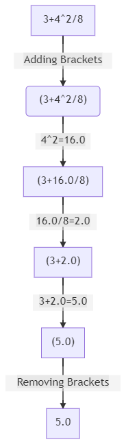
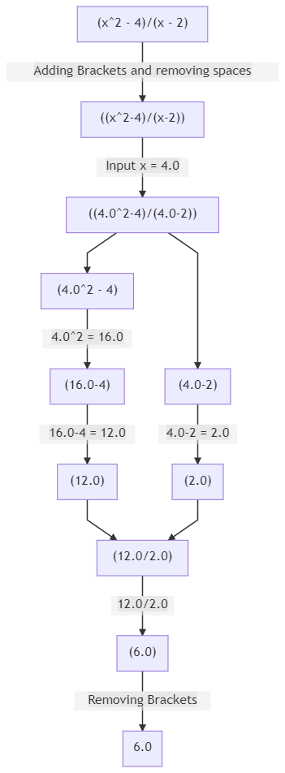
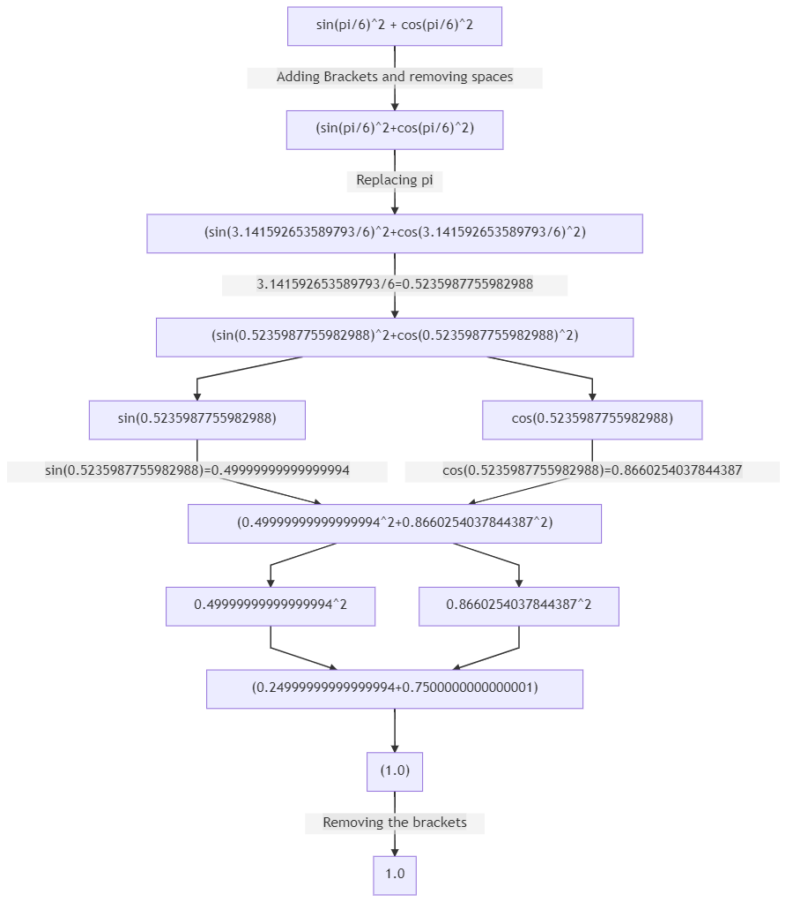
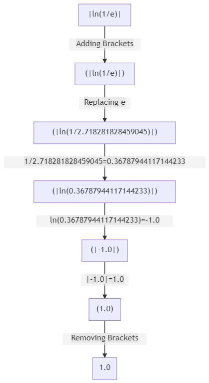

# How to Use

After adding the dependencies, you must import the class.

```bash
import com.nishant.complexcalculator.ComplexCalulator;
```

## Using Constant Functions

You need create an object of the class and pass in a string which holds the constant function.
```bash
String function = "3+4^2/8";
ComplexCalculator calc = ComplexCalculator.fromString(function);
```
Calling the compute function will return the value of the given expression.
```bash
System.out.println(calc.compute());
```
The output of the following is **5.0**.

The internal working for this is:<br>


## Using Dependent Functions

You need create an object of the class and pass in a string which holds the dependent function. Create a
Map<Character, Double> Collection and put the variables as _key_ and the value it holds as _value_. 
```bash
String function = "(x^2 - 4)/(x - 2)";
ComplexCalculator calc = ComplexCalculator.fromString(function);
Map<Character, Double> variableMap = new HashMap<>();
variableMap.put('x', 4.0);
```
Calling the compute function will return the value of the given expression.
```bash
System.out.println(calc.compute(variableMap));
```
The output of the following is **6.0**.

The internal working for this is:<br>


## Using Exponents

You can use exponents in the given string expression following the rules of using exponents in _double_ data type.
The rules for using exponents are:-
* The digits after E must not be fractional.
* The digits before E must have a integral and a fractional part.
```bash
String function = "6.626E-34/(m*v)";
ComplexCalculator calc = ComplexCalculator.fromString(function);
Map<Character, Double> variableMap = new HashMap<>();
variableMap.put('m', 9.1E-31);
variableMap.put('v', 2.1E6);
System.out.println(calc.compute(variableMap));
```
The output of the following is **3.467294610151753E-10**.

## Using Pi(π) and e

You can use _pi_ and _e_ in the middle of the expression to use its value.
```bash
String function = "pi*r^2 + e^x";
ComplexCalculator calc = ComplexCalculator.fromString(function);
Map<Character, Double> variableMap = new HashMap<>();
variableMap.put('r', 7.0);
variableMap.put('x', 0.5);
System.out.println(calc.compute(variableMap));
```

The output of the following is **155.58676129659997**.

## Using Trigonometric Functions

You can use trigonometric functions in the the expression. For traditional trigonometric functions, use the
short-hand notation.
 - sine (sin)
 - cosine (cos)
 - tangent (tan)
 - cotangent (cot)
 - secant (sec)
 - cosecant (csc)
 
```bash
String function = "sin(pi/6)^2 + cos(pi/6)^2";
ComplexCalculator calc = ComplexCalculator.fromString(function);
System.out.println(calc.compute());
```
The output of the following is **1.0**.

The internal working for this is:<br>


## Using Inverse Trigonometric Functions

To use trigonometric functions, you have to prefix "arc" to the short-hand trigonometric function notation given 
[here](#using-trigonometric-functions).

```bash
String function = "arctan(1)";
ComplexCalculator obj = ComplexCalculator.fromString(function);
System.out.println(obj.compute() * 180.0 / Math.PI);
```
The output of the following is **45.0**.

## Using Logarithmic Functions

To calculate the natural logarithm of a number, use _ln_ in the function.
*Note: the domain of the function is 0 < x < infinity*.

```bash
String function = "ln(sin(pi/2))";
ComplexCalculator obj = ComplexCalculator.fromString(function);
System.out.println(obj.compute());
```
The output of the following is **0.0**.

## Using Absolute Function

The absolute function gives the positive value of the number. For example *|x|*.

```bash
String function = "|ln(1/e)|";
ComplexCalculator calc = ComplexCalculator.fromString(function);
System.out.println(calc.compute());
```
The output of the following is **1.0**.

The internal working for this is:<br>
